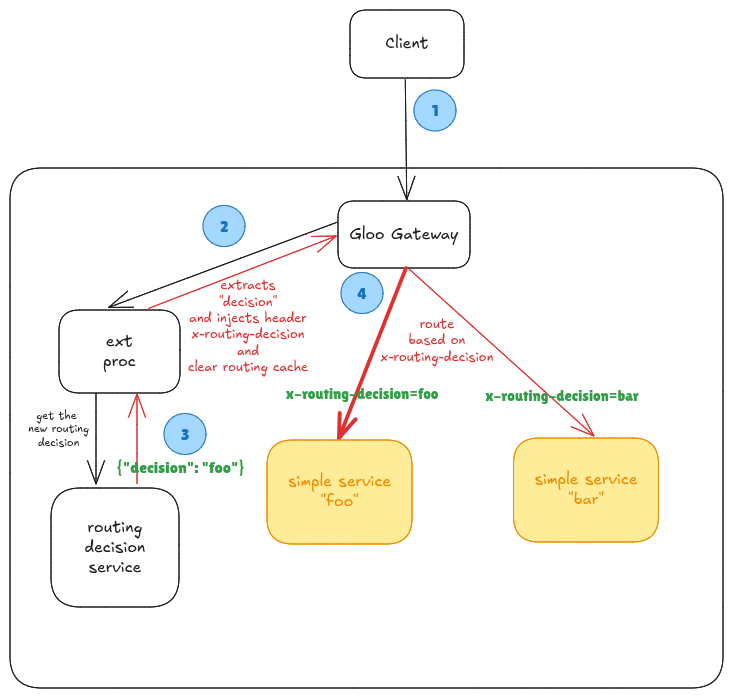

# Dynamic Routing Example

This example uses ext-proc to determine routing based on headers within the original request.  The example is inspired by work done by the customer success team in their reference architectures.

See the diagram below for an overview of the request flow.

In this example, we will deploy a simple service that returns the hostname of the service so we can see which service is processing the request.  All
routing decisions made by our ext-proc example will add a new header `x-routing-decision` to the request.  The service will randomize the target service based on a set of keys.

## Usage

This is an example external processing service that will return a routing decision to the proxy to handle dynamic routing.  

## Compatibility

This sample app has been tested to work with Gloo Gateway 2.x.

## Testing Locally

Run the `basic-demo.sh` script to install GG v2 into your cluster and configure the extproc server for dynamic routing.

You can use the `test1.sh` scripts to send data into the server and inspect the logs.

## References

This code was originally based on the sample from https://github.com/solo-io/solo-reference-architectures/tree/main/Gloo_Gateway/ext-proc-dynamic-routing-decision.